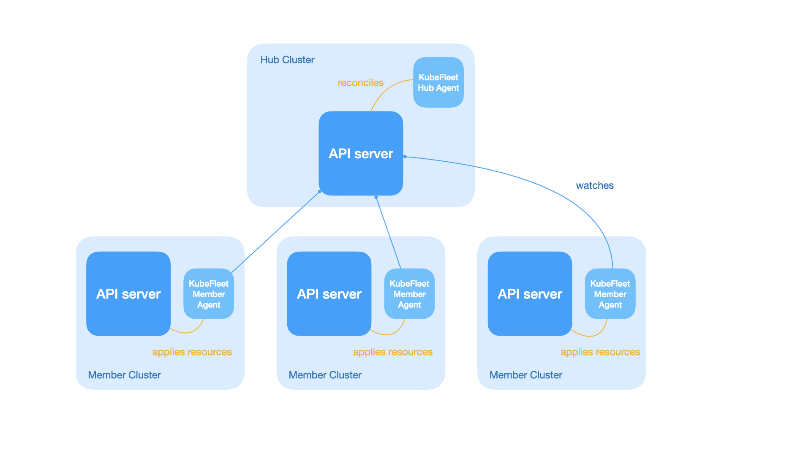
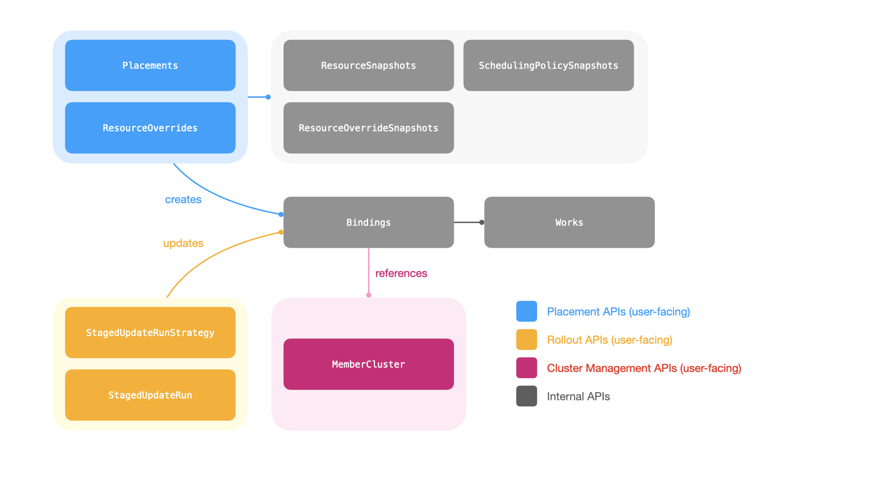

## TL;DR

* With a proper configuration, you should be able to run KubeFleet on a large-scale multi-cluster
environment with up to **1000 member clusters, 1000 placements, and 100 concurrent progressive rollouts**.
* To support deployments at such a scale:
    * it is recommended that you allocate ample CPU and memory resources for the KubeFleet hub agent. In
    our evaluation, an allocation of 8-12 cores and 16-24 GB of memory should be sufficient. On the
    other hand, in many cases, the KubeFleet member agents can run reasonably well with a much smaller resource
    allocation (e.g., 1 core and 2 GB of memory).
    * it is also recommended that you set up your KubeFleet hub cluster control plane, specifically its
    API server and the etcd storage backend, to be able to handle higher volume of requests and objects.
    The evaluation suggests that you might see the API server takes 10+ cores of CPU and 30+ GB of memory
    when there are high number of placements or progressive rollouts being processed by KubeFleet concurrently;
    the KubeFleet API objects in total consume approximately 2 GB of space on the etcd side in the
    evaluation.
* KubeFleet can still process placements and progressive rollouts reasonably fast in a larger-scale
environment:
    * Typically a placement that picks 100 member clusters in a fleet of 1000 clusters using a label
    selector can be processed within 30-60 seconds.
    * A 3-staged, non-gated progressive rollout with 50% in-stage concurrency can be completed within
    2 minutes. Running 100 of such rollouts concurrently usually takes less than 4 minutes to complete.
* As with any Kubernetes controllers, the KubeFleet agents, especially the hub agent, needs to re-sync
resources periodically or when they restart. In a larger-scale environment with many (1000) placements,
the re-processing might take around 15 minutes to complete. During this period, you might experience
some level of degraded responsiveness in the system.
* We are committed to continuously optimizing KubeFleet's performance and scalability; this report
is the result of one of the many rounds of evaluations we plan to conduct as KubeFleet continues to evolve.
The team aims to support larger-scale deployments better, with faster processing of placements and rollouts,
and less resource consumption on both the API server end and the KubeFleet agent end. The team is currently
working to revamp how KubeFleet handles heartbeat signals and cluster property collection for a smoother
experience. Please reach out to us if you have any concerns or suggestions in the domain of KubeFleet performance and scalability.

{}
Your experience with KubeFleet may vary due to a variety of factors, such as:
* the placement patterns in use (such as the size of resources to place, the complexity of scheduling policies, etc.);
* the distribution of resources across member clusters;
* the network connectivity between member clusters and the hub cluster;
* the configuration of your KubeFleet agents (such as the heartbeat interval, the cluster property provider in use,
the features enabled, etc.);
* the configuration of your KubeFleet hub cluster (such as the CPU/memory resources allocated to the API server
and its storage backend, the space available in the storage backend, etc.).

If you encounter a situation where KubeFleet is not performing up to your expectations, please feel free to reach
out to us via our community channels; we are more than happy to learn better about the scenario and work
towards a solution if possible.
{}

## Background

As cloud-native computing continues to evolve both in scale and complexity, challenges
around management of a large-scale resource pool for containerized workloads across
multiple platforms and multiple regions have become increasingly prominent for many
organizations. The exponential growth of AI-driven/AI-enhanced workloads has further
accelerated this need for a solution that enables robust distributed computing.

As an attempt to address these challenges and to provide developers with an approach that
allows simplified management of containers in a distributed environment, we began the
development of the KubeFleet project in late 2022. The project aims to explore
architectures, designs, and implementations that allow organizations to manage their 
Kubernetes clusters through one single plane, simplify the experience of running workloads
distributedly with an easy-to-use abstraction layer and a flexible API.

KubeFleet became a CNCF sandbox project in 2025. Since then we have been seeing that many teams
have started to experiment with KubeFleet, and evaluated it for production use on a larger scale.
To help developers and operators better understand KubeFleet's performance and scalability,
and to document the best practices when running KubeFleet at scale, we periodically conduct
performance and scalability tests on KubeFleet builds, and use the results to guide our
development and optimization efforts in future iterations. This document summarizes the results
of such evaluations in early 2026.

### About the KubeFleet project: its architecture and major features/APIs

As briefly introduced above, KubeFleet is a project that enables management of multiple Kubernetes
clusters with ease. It features a hub-spoke architecture; a KubeFleet deployment (a fleet)
consists of:

* **A hub cluster**: this is a Kubernetes cluster that runs the KubeFleet hub agent; it serves as the
control plane of the fleet, which allows users to place Kubernetes resources across the fleet, roll
out resource changes progressively, and monitor the status of all member clusters.
* **Multiple member clusters**: each member cluster runs an instance of the KubeFleet member agent; this
agent connects to the hub cluster and pulls resource manifests for placement, and reports back the
status of the cluster along with all the placed resources. Typically user workloads run only on the
member clusters.

KubeFleet primarily provides the following APIs for users to orchestrate their multi-cluster workloads
and monitor their member clusters:

* **The placement APIs**: users can make use of the `ClusterResourcePlacement` and
`ResourcePlacement` APIs (for cluster-scoped and namespace-scoped resources respectively) to place
arbitrary Kubernetes resources across the fleet. These APIs allow users to pick member
clusters with a scheduling policy; the KubeFleet workload scheduler can then determine the targets
for resource placement dynamically based on the policy.
* **The progressive rollout APIs**: once a set of resources are placed, users can initiate
a progressive (staged) rollout of resource changes across all picked member clusters with KubeFleet's
`StagedUpdateStrategy` and `StagedUpdateRun` APIs. Users may group member clusters into different
stages (e.g., `staging`, `canary`, `prod`), and roll out changes one stage at a time with a specific
plan. The APIs also provide users with options to manually approve a rollout stage, or set up a
cooldown period between stages, for improved control and safety.
* **The cluster management APIs**: the `MemberCluster` API helps users manage their member
clusters in the fleet, and provides a way to monitor its status. With a cluster property provider
configured, KubeFleet can collect and refresh information about a member cluster, such as its
capacity, resource availability, and costs, automatically; such information can also be used to
inform the scheduling decisions for resource placements.

With the current architecture and the feature set, the following factors might be in play when
evaluating KubeFleet's performance and scalability:

* **The number of member clusters**: each KubeFleet member agent instance is configured to send
heartbeats periodically (typically every 15-120 seconds; the value is user configurable) to the
hub cluster side via the cluster management APIs, to report the status of the host member
cluster, and to report refreshed cluster properties (if applicable). And each heartbeat
signal is a write to the hub cluster API server; as the number of member clusters climbs,
the hub cluster API server (and its `etcd` storage backend) will need to handle the
subsequent higher write throughput, which may lead to additional resource usage overhead
and increased latencies.

* **The number of placements and the number of picked target member clusters for each placement**:
when KubeFleet processes a resource placement, for each picked target member cluster, the KubeFleet
hub agent will need to create a `Binding` object and one or more `Work` objects (depending on the
size of the resource manifests). In a large fleet with many placements that each pick a high number
of target member clusters, there might be a very significant number of `Binding` and `Work` objects
in presence; they may take a considerable amount of the storage space in the hub cluster's `etcd`
storage backend, and the hub cluster API server must be prepared to handle the read/write throughput
for such objects as the KubeFleet hub agent continuously processes the placements.

* **The number of concurrently running progressive rollouts**: when a placement is set up for a
progressive rollout, the KubeFleet hub agent will scan all picked target member clusters,
manipulate related placement API objects as necessary, and monitor the health status of placed resources
as the rollout is in progress. This is a process that will repeat continuously until the rollout is completed,
and it may incur a considerable number of reads/writes on the hub cluster API server end and the storage
backend, especially when the number of concurrently running rollouts is high, and when each placement
to roll out picks a high number of target member clusters. This might also add latencies to other
KubeFleet functionalities (such as the processing of new placements) under adverse conditions.

### Our performance and scalability goals

At this moment, the KubeFleet team targets a performance/scalability goal of enabling a smooth
and responsive experience in a fleet with

* up to **1000 member clusters**; and
* up to **1000 placements**, each of which picks **100 member clusters** (10% of the fleet); and
* up to **100 concurrently running progressive rollouts**.

We focus not only on the possibility that KubeFleet can support usage at such a scale, but also on
the aspect that under this scale, KubeFleet can still complete placement and rollout operations
within a reasonable amount of time. We pay additional attention to ensuring that this is
a sustainable amount of load for KubeFleet: to be more specific, as elaborated in later sections, users
should not see any issue at this scale when they restart the KubeFleet hub agent (e.g., for upgrades),
or when the agent re-syncs (re-processes) all the resources for correctness checks. Naturally, to
support larger fleets, the hub cluster API server, its storage backend, and the KubeFleet agents
themselves will manifest a higher resource usage level; we would also make sure that such a usage
level is still within a reasonable range, so that users can run large-scale KubeFleet deployments
without having to worry about excessive costs.

**Our optimization is an on-going effort**. As we continue to tweak KubeFleet's architecture, design,
and implementation, and add more features, you might see different performance profiles across different
KubeFleet builds. We will periodically re-run the performance and scalability evaluation and publish
the latest results on our documentation site, to help adopters keep track of our progress in the domain
of performance and scalability; we might also tune our goals as we understand better about
the needs and expectations of the community.

It is also worth noting that **your actual experience may vary** depending on your specific use cases
and environment setup. There are many factors that can have an impact on KubeFleet's
performance and scalability, including but not limited to, 

* the placement patterns in use (such as the size of resources to place, the complexity of scheduling policies, etc.);
* the distribution of resources across member clusters;
* the network connectivity between member clusters and the hub cluster;
* the configuration of your KubeFleet agents (such as the heartbeat interval, the cluster property provider in use,
the features enabled, etc.);
* the configuration of your KubeFleet hub cluster (such as the CPU/memory resources allocated to the API server
and its storage backend, the space available in the storage backend, etc.).

We will try our best to cover scenarios that are representative of common KubeFleet use cases in our evaluation,
however, it is not our intention to present this document as a guarantee that the target scale can be met
under all circumstances. If you encounter a situation where KubeFleet is not performing up to your expectations,
please feel free to reach out to us via our community channels; we are more than happy to learn better about the
scenario and work towards a solution if possible.

## Target SLIs and SLOs

With the target scale in mind, we define the following SLIs and SLOs for larger-scale KubeFleet deployments:

{}
Unless otherwise specified, the evaluation assumes that a placement will:

* pick 100 member clusters with a label selector;
* select a `namespace` with a `configMap` of 1 KB data and a `deployment` with a replica count of 0.

And it assumes that a staged progressive rollout will:

* have 3 stages (with 20, 30, and 50 clusters in each stage respectively);
* have a 50% in-stage concurrency; and
* have no gates (timed wait or manual approval) between stages.

For more details about the placement and rollout configuration, see the [Methodology](#methodology) section below.
{}

### Cluster management


<table class="tg"><thead>
  <tr>
    <th class="tg-0lax">SLI </th>
    <th class="tg-0lax">SLO</th>
  </tr></thead>
<tbody>
  <tr>
    <td class="tg-0lax">The p90 queueing delay of heartbeat signal processing</td>
    <td class="tg-0lax">Less than 1 sec</td>
  </tr>
</tbody>
</table>


### Placement


<table class="tg"><thead>
  <tr>
    <th class="tg-0lax">SLI </th>
    <th class="tg-0lax">SLO</th>
  </tr></thead>
<tbody>
  <tr>
    <td class="tg-0lax">The p90 latency of completing a new placement across 10 attempts</td>
    <td class="tg-0lax">Less than 30 sec</td>
  </tr>
</tbody>
</table>



<table class="tg"><thead>
  <tr>
    <th class="tg-0lax">SLI </th>
    <th class="tg-0lax">SLO</th>
  </tr></thead>
<tbody>
  <tr>
    <td class="tg-0lax">The p90 latency of completing a new placement across 10 attempts</td>
    <td class="tg-0lax">Less than 30 sec</td>
  </tr>
  <tr>
    <td class="tg-0lax">The p90 latency of completing a resync of all placements across 10 attempts</td>
    <td class="tg-0lax">Less than 15 min</td>
  </tr>
</tbody>
</table>



<table class="tg"><thead>
  <tr>
    <th class="tg-0lax">SLI </th>
    <th class="tg-0lax">SLO</th>
  </tr></thead>
<tbody>
  <tr>
    <td class="tg-0lax">The p90 latency of completing a new placement across 10 attempts</td>
    <td class="tg-0lax">Less than 60 sec</td>
  </tr>
</tbody>
</table>


### Progressive rollout


<table class="tg"><thead>
  <tr>
    <th class="tg-0lax">SLI </th>
    <th class="tg-0lax">SLO</th>
  </tr></thead>
<tbody>
  <tr>
    <td class="tg-0lax">The p90 latency of completing a new staged progressive rollout across 10 attempts</td>
    <td class="tg-0lax">Less than 2 minutes</td>
  </tr>
  <tr>
    <td class="tg-0lax">The p90 latency of completing 100 new staged progressive rollout in parallel</td>
    <td class="tg-0lax">Less than 4 minutes</td>
  </tr>
</tbody>
</table>


### Resource usage

#### Hub cluster API server


<table class="tg"><thead>
  <tr>
    <th class="tg-0lax">SLI </th>
    <th class="tg-0lax">SLO</th>
  </tr></thead>
<tbody>
  <tr>
    <td class="tg-0lax">CPU and memory resource usage (p90)</td>
    <td class="tg-0lax">N/A (for reference only)</td>
  </tr>
</tbody>
</table>



<table class="tg"><thead>
  <tr>
    <th class="tg-0lax">SLI </th>
    <th class="tg-0lax">SLO</th>
  </tr></thead>
<tbody>
  <tr>
    <td class="tg-0lax">CPU and memory resource usage (p90)</td>
    <td class="tg-0lax">N/A (for reference only)</td>
  </tr>
</tbody>
</table>



<table class="tg"><thead>
  <tr>
    <th class="tg-0lax">SLI </th>
    <th class="tg-0lax">SLO</th>
  </tr></thead>
<tbody>
  <tr>
    <td class="tg-0lax">CPU and memory resource usage (p90)</td>
    <td class="tg-0lax">N/A (for reference only)</td>
  </tr>
</tbody>
</table>


#### Hub cluster etcd storage backend


<table class="tg"><thead>
  <tr>
    <th class="tg-0lax">SLI </th>
    <th class="tg-0lax">SLO</th>
  </tr></thead>
<tbody>
  <tr>
    <td class="tg-0lax">Storage space usage</td>
    <td class="tg-0lax">
        Nominal (<200 MB)
    </td>
  </tr>
</tbody>
</table>



<table class="tg"><thead>
  <tr>
    <th class="tg-0lax">SLI </th>
    <th class="tg-0lax">SLO</th>
  </tr></thead>
<tbody>
  <tr>
    <td class="tg-0lax">Storage space usage</td>
    <td class="tg-0lax">
        < 3 GB
    </td>
  </tr>
</tbody>
</table>


#### Hub agent


<table class="tg"><thead>
  <tr>
    <th class="tg-0lax">SLI </th>
    <th class="tg-0lax">SLO</th>
  </tr></thead>
<tbody>
  <tr>
    <td class="tg-0lax">CPU and memory resource usage (p90)</td>
    <td class="tg-0lax">Nominal (<1 cores, <512 MB)</td>
  </tr>
</tbody>
</table>



<table class="tg"><thead>
  <tr>
    <th class="tg-0lax">SLI </th>
    <th class="tg-0lax">SLO</th>
  </tr></thead>
<tbody>
  <tr>
    <td class="tg-0lax">CPU and memory resource usage (p90) when the agent restarts/re-syncs</td>
    <td class="tg-0lax">< 6 cores and <16 GB</td>
  </tr>
</tbody>
</table>



<table class="tg"><thead>
  <tr>
    <th class="tg-0lax">SLI </th>
    <th class="tg-0lax">SLO</th>
  </tr></thead>
<tbody>
  <tr>
    <td class="tg-0lax">CPU and memory resource usage (p90)</td>
    <td class="tg-0lax">< 6 cores and <16 GB</td>
  </tr>
</tbody>
</table>


#### Member agent


<table class="tg"><thead>
  <tr>
    <th class="tg-0lax">SLI </th>
    <th class="tg-0lax">SLO</th>
  </tr></thead>
<tbody>
  <tr>
    <td class="tg-0lax">CPU and memory resource usage (p90)</td>
    <td class="tg-0lax">Nominal (<0.5 cores, <128 MB)</td>
  </tr>
</tbody>
</table>



<table class="tg"><thead>
  <tr>
    <th class="tg-0lax">SLI </th>
    <th class="tg-0lax">SLO</th>
  </tr></thead>
<tbody>
  <tr>
    <td class="tg-0lax">CPU and memory resource usage (p90) when the agent restarts/re-syncs</td>
    <td class="tg-0lax">Nominal (<1 cores, <512 MB)</td>
  </tr>
</tbody>
</table>



<table class="tg"><thead>
  <tr>
    <th class="tg-0lax">SLI </th>
    <th class="tg-0lax">SLO</th>
  </tr></thead>
<tbody>
  <tr>
    <td class="tg-0lax">CPU and memory resource usage (p90)</td>
    <td class="tg-0lax">Nominal (<1 cores, <512 MB)</td>
  </tr>
</tbody>
</table>


## Methodology

### The evaluation environment setup

This round of KubeFleet performance/scalability evaluation uses the KubeFleet build at commit
`382c2c` ([Link on GitHub](https://github.com/kubefleet-dev/kubefleet/commit/382c2cfe2287b552de96c5f3468db05668e90a9f), committed on Apr 1, 2026).

The evaluation environment uses a standard-tier AKS cluster as the hub cluster. The cluster is created
in the Azure `westus2` region, and has one node pool of 2 `Standard_D16s_v3` nodes (16 vCPUs and 64 GB memory each).
It runs Kubernetes v1.34.4, and has the following AKS features enabled: 

* Microsoft Entra integration for Kubernetes authentication and authorization
* Azure CNI node subnet networking

The hub cluster manages 1000 member clusters. Each member cluster is a virtual Kubernetes cluster
created using [the `vCluster` project](https://www.vcluster.com/), version 0.32.1. The member clusters
are configured to also run Kubernetes v1.34.4. The 1000 member clusters are evenly spread across
20 host clusters (50 virtual member clusters per host cluster); the host clusters are created
in the same Azure region as the hub cluster (`westus2`), and each of them has one node pool of 4
`Standard_D16s_v3` nodes (16 vCPUs and 64 GB memory each). The host clusters are also
standard-tier AKS clusters with the same set of features enabled as the hub cluster. The hub cluster and all the
host clusters reside on separate Azure virtual networks; the KubeFleet member agents connect to the
hub cluster API server via its public endpoint. We anticipate that the network latency between
the hub cluster and the host clusters is of low single-digit milliseconds (network latencies in the same
Azure region over Azure's backbone network are typically around 1-2 milliseconds).

For the KubeFleet hub agent, it was deployed with the following configuration:

* its CPU/memory resource requests are set to 1 core and 1 GB respectively
* its CPU/memory resource limits are set to 12 cores and 24 GB respectively
* it has the validation webhooks enabled

> If a specific setting is not mentioned here in the list, it uses the default value as specified in
> the KubeFleet hub agent Helm chart.

As for the KubeFleet member agents, they were deployed with the following configuration:

* their CPU/memory resource requests are set to 0.1 core and 128 MBs respectively
* their CPU/memory resource limits are set to 1 core and 2 GB respectively
* they have the Azure cluster property provider enabled
* they have priority-based queueing enabled

> If a specific setting is not mentioned here in the list, it uses the default value as specified in
> the KubeFleet member agent Helm chart.

This evaluation environment configures each member cluster to send a heartbeat every 60 seconds.

### The evaluation steps

The performance/scalability evaluation process consists of the following steps:

* Set up the hub cluster and the member clusters as specified above.
    * Collect the hub cluster API server's resource usage data (CPU and memory), and the etcd
    storage backend's space usage; this helps establish a baseline for the resource usage levels.
* Join the 1000 member clusters into the fleet.
    * Each member cluster is assigned with a unique index, from 1 to 1000.
    * For a member cluster of index `i`, it is labeled with a resource group `resource-group=i%10`.
    * A member cluster is also assigned with an environment label:
        * Member clusters with index between `[1, 200]` are labeled with `env=staging`;
        * Member clusters with index between `[201, 500]` are labeled with `env=canary`;
        * Member clusters with index between `[501, 1000]` are labeled with `env=prod`.
* After the joining completes successfully, collect the following data:
    * The hub cluster API server's resource usage data (CPU and memory), and etcd storage
    backend's space usage;
    * The p90 queueing delay of heartbeat signal processing on the KubeFleet hub agent side;
    * The KubeFleet hub agent's resource usage data (CPU and memory);
    * The KubeFleet member agents' resource usage data (CPU and memory), as sampled from 10 randomly selected instances.
* Create 1 placement that picks 100 member clusters using a scheduling policy with a label
selector of `resource-group=N`. The placement is set to select a namespace, and a config map
of 1 KB data + a deployment that runs the Kubernetes `pause` image with a replica count of 0.
Repeat this step for 10 times with `N` set to `0-9` respectively.
    * Collect the p90 latency of placement processing across the 10 attempts.
* Create 1000 placements that each picks 100 member clusters. Each placement is assigned with an
index `i` from 1 to 1000, and it features a scheduling policy with a label selector of
`resource-group=N`, where `N=i%10`. Similar to the setup above, each placement is set
to select a namespace, and a config map of 1 KB data + a deployment that runs the
Kubernetes `pause` image with a replica count of 0. Wait until all the placements
are complete.
* Downscale the hub agent replica count to 0, wait until the pod is gracefully
terminated, and then upscale it back to 1; this simulates a restart/re-sync process
of the hub agent. Repeat this step for 10 times.
    * Collect the p90 re-syncing completion time after the hub agent restarts.
* Create one additional (1000 + 1) placement that picks 100 member clusters, with a
scheduling policy with a label selector of `resource-group=N`. Once again, the placement
is set to select a namespace, and a config map of 1 KB data + a deployment that runs the
Kubernetes `pause` image with a replica count of 0. Repeat this step for 10 times with
`N` set to `0-9` respectively.
    * Collect the p90 latency of placement processing across the 10 attempts.
* Initiate a progressive rollout for a placement of index `N`. The rollout uses a strategy
that has 3 stages (start with all `staging` clusters, then `canary` clusters, and
finally `prod` clusters), a 50% in-stage concurrency, and no gates (timed wait or manual approval)
between stages. Repeat this step for 10 times with `N` set to `0-9` respectively.
    * Collect the p90 latency of rollout processing across the 10 attempts.
* Start 100 progressive rollouts concurrently for placements of index `N` between `[1, 100]`.
The rollouts use the same policy as previously described. Wait until all the rollouts
are complete.
    * Collect the p90 latency of rollout processing for the 100 concurrent rollouts.
* While the 100 concurrent rollouts are in progress, create one additional (1000 + 1) placement
in the same way as previously described. Repeat this step for 10 times.
    * Collect the p90 latency of placement processing across the 10 attempts.
* At last, collect the following resource usage data when there are 1000 member clusters +
1000 placements + 100 concurrent progressive rollouts in the fleet:
    * The hub cluster API server's resource usage data (CPU and memory);
    * The hub cluster etcd storage backend's space usage;
    * The KubeFleet hub agent's resource usage data (CPU and memory);
    * The KubeFleet member agents' resource usage data (CPU and memory), as sampled from 10 randomly selected instances.

### Tools and utilities

The scripts and utilities programs used in the evaluation process are checked into the
[KubeFleet source repository](https://github.com/kubefleet-dev/kubefleet/tree/main/hack/perftest).
For more information, see the `README` file in the linked directory.

The metrics collected in the process come from two sources:

* The CPU/memory usage of KubeFleet agents are collected via the
[kube-prometheus-stack](https://artifacthub.io/packages/helm/prometheus-community/kube-prometheus-stack).
The stack is configured to scrape data points from the agents' exposed metrics endpoints.
The KubeFleet agents expose the default set of controller runtime metrics in addition to a few
metrics specific to KubeFleet's functionalities.
* The CPU/memory usage of the hub cluster API server, and the space usage of the hub cluster
etcd storage backend, are collected via Azure Monitoring tools.

## Results and Analysis

### Joining 1000 member clusters into the fleet

As a baseline for comparison, when the hub cluster is first provisioned and idling, the API
server shows nominal CPU usage (~0.2 cores) and limited memory usage (~900 MBs);
on the storage side, around 20 MBs of space is used.

As we join the 1000 member clusters into the fleet (with a heartbeat interval of 60 seconds),
we begin to see limited increases in the hub cluster API server's resource usage level;
the CPU usage jumps to around 0.65 cores, and the memory usage a bit less than 1.4 GB.
The added KubeFleet cluster management API objects (`MemberClusters`,
`InternalMemberClusters`, etc.) take around 100 MBs more space in the etcd storage backend.

| | Idling | After joining 1000 member clusters |
| --- | --- | --- |
| Hub cluster API server CPU usage | 252 millicores | 655 millicores |
| Hub cluster API server memory usage | 871 MBs | 1392 MBs |
| etcd storage backend usage | 23.4 MBs | 119 MBs |

As one would expect, processing the heartbeat signals is an easy job for the KubeFleet
hub agent; we see almost no queueing delays on the controller end. The hub agent's CPU usage
is less than 100 millicores, and its memory usage a bit more than 200 MBs.

| | After joining 1000 member clusters | Expectation (SLO) |
| --- | --- | --- |
| p90 queueing delay of heartbeat signal processing on the hub agent side | 0.06s | Less than 1s ✔ |
| Hub agent CPU usage | 93 millicores | Less than 1 core ✔ |
| Hub agent memory usage | 234 MBs | Less than 512 MBs ✔ |

At this point of the evaluation a member agent instance needs to do very little work (just
sending the heartbeat signal every 60 seconds), and consequently it consumes barely any
CPU and memory resources: the CPU usage is less than 5 millicores, and the memory below 50 MBs.

| | After joining 1000 member clusters | Expectation (SLO) |
| --- | --- | --- |
| Member agent CPU usage | 2.4 millicores | Less than 0.5 core ✔ |
| Member agent memory usage | 32.8 MBs | Less than 128 MBs ✔ |

### Placing resources

#### The first placement

It takes KubeFleet around 20 seconds (p90) to process a new placement that picks 100 member
clusters in a fleet of 1000 member clusters, when there are no other placements or rollouts running.
We do see some level of variation across different attempts, with the latencies ranging
between <10 seconds and 22 seconds. The result is reasonable and within our expectations,
as the KubeFleet hub agent needs to filter out clusters and create 100 `Binding` objects and
100 `Work` objects in the hub cluster to facilitate the propagation of resources.

| min | p25 | p50 | p75 | p90 | max | Expectation (SLO) |
| --- | --- | --- | --- | --- | --- | --- |
| 9s | 12s | 18s | 19s | 20s | 22s | p90 less than 30s ✔ | 

#### The 1000 placements

We then create 1000 placements of similar configurations in parallel and wait for their
completion. Once they are all done, we profile how well the KubeFleet hub agent can handle
the 1000 placements when the agent restarts/re-syncs. Consistent with the standard
Kubernetes controller development practices, to ensure system correctness, the KubeFleet
hub agent will re-process all placements in a fleet hub cluster when it restarts, in case
a change has been applied during the agent downtime. The agent is also configured to
repeat this re-processing step periodically (every 6 hours by default), as to make sure
that all changes will be captured and processed. This is a cost we have to cover nonetheless,
despite the fact that often there will not be any change to process at all. 

Re-processing 1000 placements can be an expensive operation. As briefly discussed earlier,
every time a placement picks a member cluster, the KubeFleet hub agent will spawn a
corresponding `Binding` object and one or more `Work` objects to facilitate the propagation
of resources to the said member cluster; in our scenario, 1000 placements that each picks 100
member clusters will lead to the creation of around 100K `Binding` objects and 100K `Work` objects
in the hub cluster. Re-processing them not only takes time, but also comes with a side
effect: when the KubeFleet hub agent is busy re-processing existing placement API objects,
newly created placements will be stuck waiting in the queue, and consequently on the user
end one might experience a period of unresponsiveness when placing resources. The faster
we can complete the re-processing, the shorter such a period of unresponsiveness will be.

In the current build, it can take a bit more than 10 minutes for the re-processing of 1000
placements to complete:

| min | p25 | p50 | p75 | p90 | max | Expectation (SLO) |
| --- | --- | --- | --- | --- | --- | --- |
| 568s | 583s | 625s | 652s | 675s | 821s | p90 less than 900s ✔ |

During the re-processing period, one might observe spikes in KubeFleet hub agent
CPU and memory usage; in the evaluation, the CPU usage can go up to around 3.5 cores,
and the memory usage a bit more than 8 GB. Considering that the hub agent has not yet
exhausted its CPU resource limit, it might be safe for us to assume that the bottleneck
is rather on the I/O side; the API server might get a bit overwhelmed by the increased
number of requests coming from the hub agent. We have observed latency spikes on the
API server during the re-processing period, which further corroborates with this assumption.
The result is also a reminder that for a larger fleet with many placements, a larger
allocation of memory resource for the KubeFleet hub agent is a must: without enough
memory available, the agent might get OOM killed when it is time to re-sync.

On the hub cluster API server side, the CPU usage level can reach around 13 cores, and
the memory usage will go to 47GB. The usage will drop after the re-syncing has concluded.
For AKS clusters, such a heightened level might not be very ideal but still remains
manageable. We will continue to optimize our controllers to reduce the volume of requests
during re-syncs, which should help bring down both the re-processing latency and the resource
usage level on the hub cluster API server side.

The 1000 placements, along with the spawned 100K `Binding` and 100K `Work` objects, take around
1.6 GB of space in the etcd storage backend. For reference, etcd features a default space limit of
2 GB and the limit can be raised to 8 GB if needed; all AKS clusters of the standard
tier and above use the 8 GB limit. In other words, for larger fleets, storing KubeFleet API objects
alone will use up 25% or more of the available etcd storage space; as a result, we strongly
recommend that users with a larger fleet and many placements use the KubeFleet hub cluster
exclusively for the multi-cluster resource management purposes, and do not run (too many) user workloads
in the cluster. At this moment we have not yet received any report of the storage space usage becoming
a bottleneck for KubeFleet users; however, if needed, we are open to explore options that
can help reduce the space usage level.

In this scenario the re-syncing happens after all the placements have been completed.
Consequently the process has very little impact on the KubeFleet member agents' end.
We continue to see nominal level of CPU and memory usage (a few millicores and around
40MBs respectively) there during the re-processing period.

#### The 1000 + 1 placement

The number of existing placements in the hub cluster has very little impact on the
processing latency of new placements. The evaluation reports that creating one
additional placement on top of the 1000 placements takes around 21 seconds to complete
(p90), which is very close to the latency of creating the very first placement
in the system.

| min | p25 | p50 | p75 | p90 | max | Expectation (SLO) |
| --- | --- | --- | --- | --- | --- | --- |
| 11s | 13s | 17s | 19s | 21s | 22s | p90 less than 30s ✔ | 

### Rolling out changes progressively

#### The first staged rollout

It takes KubeFleet around 96 seconds (p90) to complete a staged rollout for a placement that
picks 100 member clusters, with a rollout strategy of 3 stages (20 `staging` clusters first,
30 `canary` clusters next, and 50 `prod` clusters last) and a 50% in-stage concurrency.
Variance is limited across the 10 attempts.

| min | p25 | p50 | p75 | p90 | max | Expectation (SLO) |
| --- | --- | --- | --- | --- | --- | --- |
| 91s | 92s | 95s | 96s | 96s | 96s | p90 less than 2 minutes ✔ | 

#### The 100 concurrent staged rollouts

Next in the evaluation, we start 100 staged rollouts of the same configuration for 100
separate placements in parallel, and wait for their completion. The swarming puts some
additional pressure on the system, and compared to the single rollout scenario, we see
that processing latency grows by roughly 1.4x, with the p90 latency reaching around
135 seconds.

| min | p25 | p50 | p75 | p90 | max | Expectation (SLO) |
| --- | --- | --- | --- | --- | --- | --- |
| 116s | 122s | 132s | 134s | 135s | 136s | p90 less than 4 minutes ✔ |

The hub agent uses a bit more than 5 CPU cores during the period; it has not yet exhausted
its CPU resource limit, suggesting that the increase in latency might attribute more to the
I/O side and the API server side. The memory usage is 11.2 GB.

Staged rollouts at this scale do not require too much work on the member agent side. We still
see very limited resource usage level there, with the CPU usage at a few millicores, and the
memory usage around 40 MBs.

For the hub cluster API server, it uses more than 8 CPU cores during the rollout, and
more than 31 GB of memory. As explained earlier, we remain committed to further
optimizations in this area in future iterations. Hosting the 1000 member clusters + 1000
placements + 100 concurrent staged rollouts takes less than 1.6 GB of space in the
hub cluster etcd storage backend.

#### Processing a placement during 100 concurrent staged rollouts

We have also conducted a test where we attempt to create a placement while the 100
staged rollouts are in session. The processing latency in this setting grew to around
30 seconds (p90), which is around 50% higher than usual, due to the fact that both
the hub cluster API server and the KubeFleet hub agent are busying handling the rollouts and
have less bandwidth to deal with the new placement. 

| min | p25 | p50 | p75 | p90 | max | Expectation (SLO) |
| --- | --- | --- | --- | --- | --- | --- |
| 19s | 21s | 22s | 25s | 30s | 32s | p90 less than 60 seconds ✔ | 

## Conclusion and Next Steps

The KubeFleet development team strives to continuously evolve KubeFleet's architecture,
design, and implementation to meet the needs of multi-cluster management at a larger scale.
The performance and scalability evaluation we have performed so far has revealed that 
**KubeFleet can support larger-scale deployments, with 1000 member clusters + 1000 placements +
100 concurrent progressive rollouts reasonably well with the right configuration**. Of course,
the actual experience may vary depending on the specific use cases and environment setup; if
you encounter a situation where KubeFleet is not performing satisfactorily, please reach
out to us via our community channels for further discussions.

As of now, aside from the optimization work wishlisted in this document, we have started an
effort to revamp the way KubeFleet agents handle heartbeats and cluster property refreshes;
it is our hope that with a new design, we could remove some unnecessary pressure from the hub
cluster API side without compromising the freshness of cluster status and properties, and
consequently achieve a more responsive and efficient experience in larger deployments. We would be happy
to discuss more about this and quantify its impact with a new round of performance/scalability
evaluation in the future.
